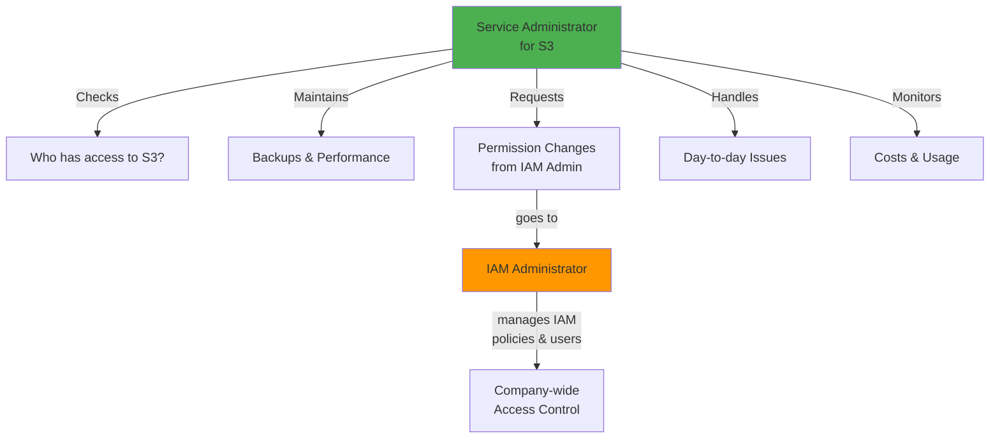
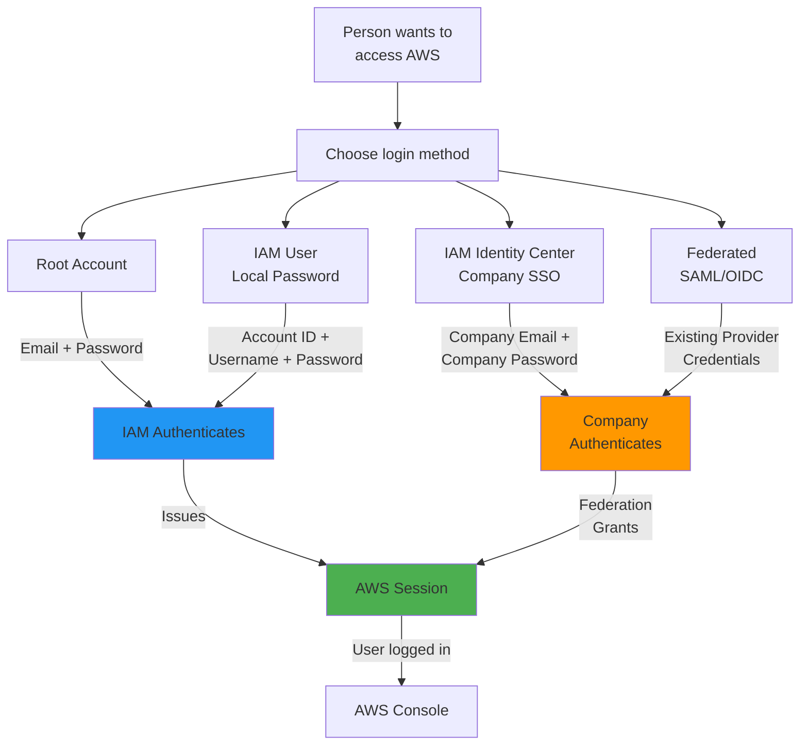
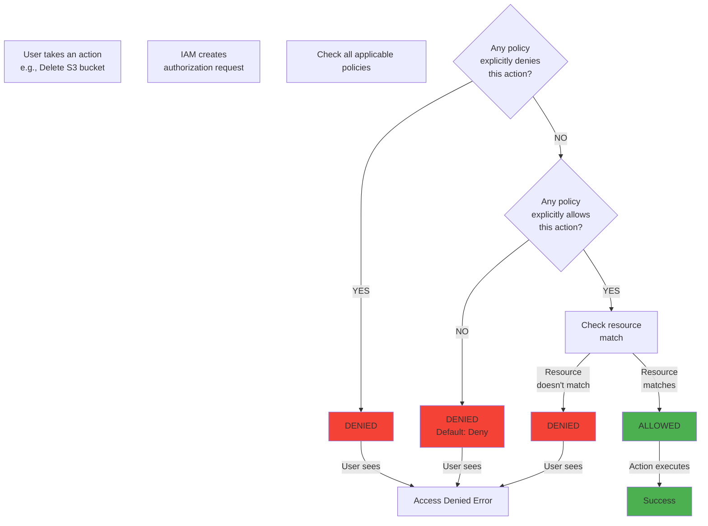
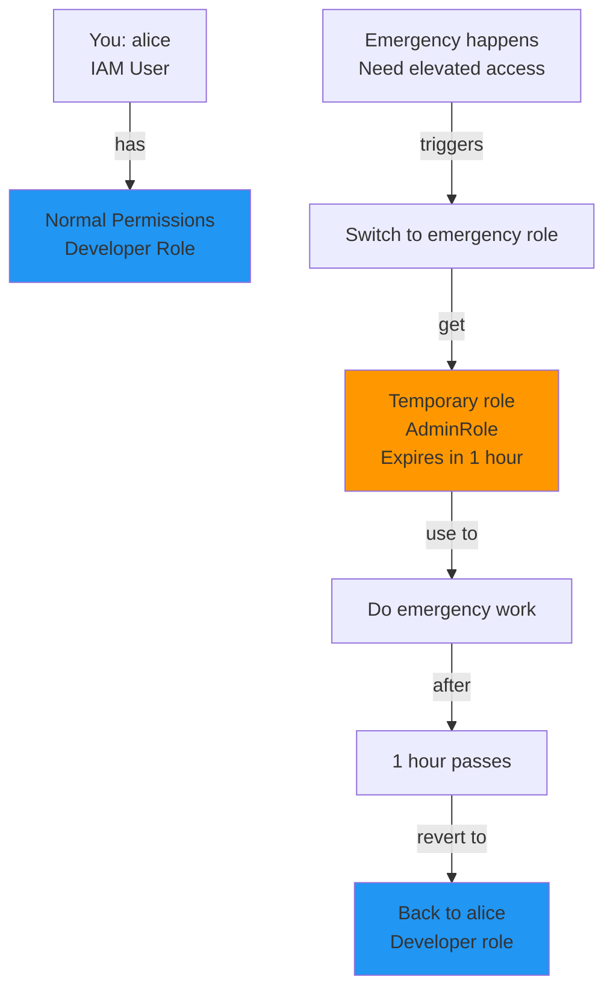
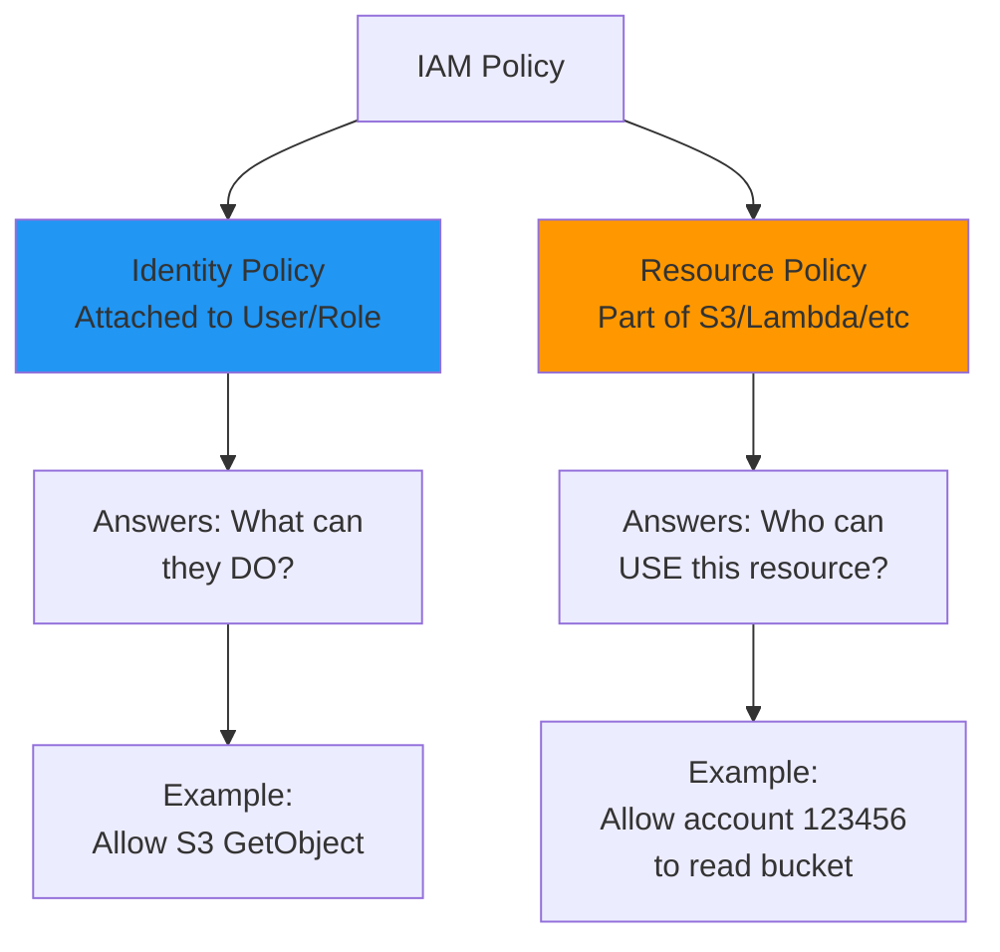
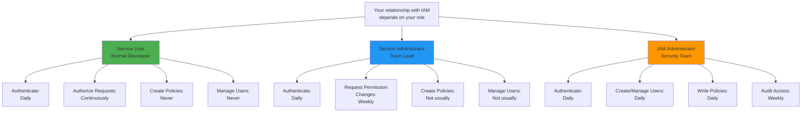

# When Do I Use IAM? — Complete Breakdown

---

## The core question

**"Every time I use AWS? Or only in specific situations?"**

**Answer: You use IAM every single time you access AWS. It's constant.**

---

## Three Different User Roles (Each Uses IAM Differently)

When you access AWS, you fall into ONE of these roles:

### Role 1: Service User (Normal Developer/Employee)

You're a developer hired to build features.

**Your responsibilities:**
- Write code
- Deploy to AWS
- Use AWS services (S3, Lambda, databases)

**You DON'T:**
- Create IAM users
- Manage IAM policies
- Decide who gets access

**When YOU use IAM:**
```
Every time you:
✓ Sign in to AWS Console  → IAM authenticates you
✓ Run AWS CLI command     → IAM checks permissions
✓ Call AWS API            → IAM authorizes action
✓ Deploy code             → IAM verifies you can deploy
```

**Example: Typical Day**

```
9:00 AM → You sign in to AWS Console
         IAM asks: "Are you valid?"
         IAM checks credentials
         IAM grants access

9:15 AM → You navigate to S3
         IAM asks: "Can this user access S3?"
         IAM checks policy
         IAM grants S3 access

9:45 AM → You try to create RDS database
         IAM asks: "Can this user create RDS?"
         IAM checks policy
         Result: "No permission"
         You see error: "AccessDenied"
         You message your administrator

10:00 AM → Admin updates your policy
          You try again
          IAM checks new policy
          Now it works
```

**Your IAM Experience:**
- ✅ You authenticate (sign in)
- ✅ You get authorized (granted access)
- ❌ You don't create policies
- ❌ You don't create users
- ❌ You don't manage permissions

---

### Role 2: Service Administrator (Team Lead/Service Owner)

You're responsible for ONE AWS service (S3, Lambda, EC2, etc.) at your company.

**Your responsibilities:**
- Keep your service running 24/7
- Manage access to your service
- Grant permissions to your team
- Monitor costs
- Request changes from IAM administrator

**You DO:**
- Access IAM to check which users have access
- Request permission changes
- Monitor who's using your service

**You DON'T:**
- Write IAM policies (IAM admin does that)
- Create users (IAM admin does that)
- Make global security decisions

**When YOU use IAM:**

```
Scenario 1: New developer joins your team
           You: "We need this person to access S3"
           You → Submit request to IAM admin
           IAM Admin: "OK, I'll create IAM user"
           IAM Admin: "I'll attach S3 policy"
           IAM Admin: "Done"
           You: "Welcome! Here's your AWS login"

Scenario 2: Someone left the company
           You: "Developer alice is leaving"
           You → Submit request to IAM admin
           IAM Admin: "I'll remove her IAM user"
           IAM Admin: "All her credentials revoked"

Scenario 3: Developer needs more permissions
           Developer: "I need to access RDS too"
           Developer → Asks you
           You: "I'll request this from IAM admin"
           You → Submit request to IAM admin
           IAM Admin: "Updated policy"
           Done
```

**Your IAM Experience:**
- ✅ You access IAM console to view users
- ✅ You request permission changes
- ✅ You understand policies (conceptually)
- ❌ You don't write complex policies
- ❌ You don't decide global security

**Diagram: Service Admin Responsibilities**



---

### Role 3: IAM Administrator (Security Team / Senior DevOps)

You manage IAM for the entire company.

**Your responsibilities:**
- Create and delete IAM users
- Write and update IAM policies
- Manage IAM groups and roles
- Set security policies
- Audit access
- Respond to permission requests

**You DO:**
- Write complex IAM policies
- Create users and groups
- Make security decisions
- Review CloudTrail logs
- Implement least-privilege access
- Set password policies
- Manage MFA
- Configure federation (SSO)

**You DON'T:**
- Use individual AWS services (that's your team's job)
- Run applications
- Manage databases or servers

**When YOU use IAM:**

```
Every day:
✓ Create IAM users
✓ Manage IAM groups
✓ Write and test policies
✓ Review CloudTrail logs
✓ Update permissions
✓ Configure security features
✓ Respond to permission requests
✓ Audit access
```

**Example: Typical Week**

```
Monday 9 AM:
  New developer john joins company
  You create IAM user "john"
  You add john to "Developers" group
  john can now sign in

Monday 2 PM:
  Developer jane requests access to database
  You write policy to grant RDS access
  You attach policy to jane's user

Tuesday 10 AM:
  Developer bob left company
  You delete IAM user "bob"
  bob can't sign in anymore
  All his credentials revoked

Wednesday 3 PM:
  Review CloudTrail logs
  See someone deleted 5 S3 buckets
  Check who did it (IAM user = alice)
  Call alice: "Did you mean to delete these?"
  Alice: "No! I thought those were test buckets"
  You recover from backup

Thursday 9 AM:
  Write new security policy
  "All developers must use MFA"
  You configure MFA requirement

Friday 2 PM:
  Set up SSO integration
  Employees can now login with company credentials
  No more separate AWS passwords needed
```

**Your IAM Experience:**
- ✅ You understand everything about IAM
- ✅ You write policies daily
- ✅ You make security decisions
- ✅ You audit and monitor
- ✅ You respond to permission requests

---

## When YOU Authenticate (Sign In)

```
This happens EVERY TIME anyone signs in to AWS
```

### Authentication Paths

**Path 1: Sign in as Root User**

```
Browser → https://signin.aws.amazon.com
          ↓
          Enter Email Address
          Enter Password
          ↓
          IAM checks in database:
          - Email matches?
          - Password correct?
          ↓
          Yes → Signed in as root user

Credentials needed:
- Email address you registered with
- Root password
```

**Path 2: Sign in as IAM User**

```
Browser → https://signin.aws.amazon.com
          ↓
          Enter AWS Account ID (or alias)
          Enter IAM Username
          Enter IAM Password
          ↓
          IAM checks:
          - Account ID exists?
          - Username exists?
          - Password correct?
          ↓
          Yes → Signed in as IAM user

Credentials needed:
- AWS Account ID (e.g., 123456789012)
- IAM username (e.g., alice)
- IAM password (created by admin)
```

**Path 3: Use IAM Identity Center (SSO)**

```
Browser → Custom company URL
          (e.g., https://mycompany.awsapps.com)
          ↓
          Click "Login with Company Email"
          ↓
          Redirects to company login page
          ↓
          Enter company email
          Enter company password
          (the password you use for Outlook, Slack, etc.)
          ↓
          Company verifies identity
          ↓
          Sends temporary AWS credentials
          ↓
          Click which AWS account to access
          ↓
          Choose which permission set
          ↓
          Logged into AWS

Credentials needed:
- Company email (you already knew this)
- Company password (you already knew this)
- No AWS-specific password needed!
```

**Path 4: Use Federated Identity (SAML, OIDC)**

```
Same as Path 3, but with external provider:
- Okta
- Microsoft Azure AD
- Google
- Custom enterprise system

Result: Same as Path 3
You sign in once with your existing credentials
AWS accepts these credentials via federation
```

**Diagram: Authentication Paths**



---

## When YOU Are Authorized (Permissions Checked)

After you're authenticated, every action you take requires authorization.

```
This happens EVERY SINGLE ACTION
```

### Authorization Examples

**Example 1: Viewing S3**

```
You: Click on "S3" in AWS Console
        ↓
AWS creates authorization request:
        {
          "Principal": "alice",
          "Action": "s3:ListAllMyBuckets",
          "Resource": "*"
        }
        ↓
IAM checks: Does alice have policy allowing s3:ListAllMyBuckets?
        ↓
Policy found:
        {
          "Effect": "Allow",
          "Action": "s3:*",
          "Resource": "*"
        }
        ↓
Result: ALLOWED
        ↓
You see: "S3 buckets you have access to:"
        - bucket1
        - bucket2
```

**Example 2: Creating EC2 Instance**

```
You: Click "Launch Instance" in EC2
        ↓
AWS creates authorization request:
        {
          "Principal": "bob",
          "Action": "ec2:RunInstances",
          "Resource": "*"
        }
        ↓
IAM checks: Does bob have permission?
        ↓
Looking for policy...
        ↓
Policy found:
        {
          "Effect": "Allow",
          "Action": ["s3:*"],
          "Resource": "*"
        }
        ↓
Wait... this only allows S3 actions
        NO EC2 actions
        ↓
Result: DENIED
        ↓
You see: "User: bob is not authorized to perform: 
        ec2:RunInstances on resource: *"
```

**Example 3: Reading CloudWatch Logs**

```
You: Click on "CloudWatch" → "Logs"
        ↓
AWS creates authorization request:
        {
          "Principal": "charlie",
          "Action": "logs:DescribeLogGroups",
          "Resource": "*"
        }
        ↓
IAM checks policy...
        ↓
Policy found:
        {
          "Effect": "Allow",
          "Action": "logs:DescribeLogGroups",
          "Resource": "/aws/lambda/prod-functions"
        }
        ↓
But you tried to access: "/aws/lambda/dev-functions"
        Resource doesn't match!
        ↓
Result: DENIED
        ↓
You see: "You don't have permission to access logs 
        in this log group"
```

### Authorization Decision Tree



---

## When YOU Assume an IAM Role (For Temporary Access)

Sometimes you don't stay logged in as one user. Instead, you switch to a different role.

### What's Role Assumption?

```
Current state: You're logged in as "alice" (IAM user)
              Alice has basic permissions

You need:     Temporary elevated permissions to do maintenance

Solution:     Alice "assumes" the "MaintenanceRole"
              This role has elevated permissions

Result:       Temporarily, you have the extra permissions
              After 1 hour, permissions expire
              You're back to being alice
```

### Real Example: Emergency Maintenance

```
Normal day:
  Developer alice
  Can deploy code to S3
  Can't delete databases

Emergency: Production database corrupted
           Need to restore from backup
           Restoration requires elevated permissions

Alice: "I need to do database restore"
Admin: "I'll grant that temporarily"
Alice: "How?"
Admin: "Switch to the DatabaseEmergencyRole"

In AWS Console → Alice clicks "Switch role"
Enters: Role name = "DatabaseEmergencyRole"
        Account = "123456789012"

Alice is now temporarily:
- Logged in as alice
- But with DatabaseEmergencyRole permissions
- Can now restore database
- Role expires in 1 hour
- Permissions automatically revoked
- Back to alice permissions
```

### When Roles Are Used

```
Scenario 1: Cross-account access
           Alice works in Account-Dev
           Needs temporary access to Account-Prod
           Solution: Alice assumes cross-account role
           
Scenario 2: Service-to-service access
           Lambda function needs to read S3
           Solution: Attach role to Lambda
           Lambda assumes role automatically
           
Scenario 3: Emergency admin access
           Developer needs temporary elevated permissions
           Solution: Assume admin role temporarily
           
Scenario 4: Third-party access
           Auditor needs to review logs
           Solution: Auditor assumes read-only role
           Role expires after audit
```

**Diagram: Role Assumption Flow**



---

## When YOU Create Policies and Permissions

This is the IAM administrator's main job.

### Policy Creation Process

**Step 1: Identify What Users Need**

```
Department: Data Science
Need: Access to S3 bucket for data analysis

Question: What specific actions?
Answer: S3:GetObject, S3:ListBucket

Question: Which resources?
Answer: Only s3://data-science-bucket/*

Question: Any conditions?
Answer: Only during business hours (9 AM - 6 PM)
```

**Step 2: Write the Policy**

```json
{
  "Version": "2012-10-17",
  "Statement": [
    {
      "Sid": "DataScienceS3Access",
      "Effect": "Allow",
      "Action": [
        "s3:GetObject",
        "s3:ListBucket"
      ],
      "Resource": "arn:aws:s3:::data-science-bucket/*",
      "Condition": {
        "IpAddress": {
          "aws:SourceIp": [
            "203.0.113.0/24"
          ]
        }
      }
    }
  ]
}
```

**Step 3: Attach to User/Group/Role**

```
Policy created
        ↓
Attach to "DataScientists" group
        ↓
All users in group get permissions
        ↓
New users added to group automatically get permissions
```

### Trust Policies vs Identity Policies

**Identity Policies: "What can this user DO?"**

```json
{
  "Effect": "Allow",
  "Action": "s3:GetObject",
  "Resource": "arn:aws:s3:::bucket/*"
}
```

Answers: "Can this user read S3 objects?"

**Trust Policies: "WHO can assume this role?"**

```json
{
  "Effect": "Allow",
  "Principal": {
    "Service": "lambda.amazonaws.com"
  },
  "Action": "sts:AssumeRole"
}
```

Answers: "Can Lambda assume this role?"

**Diagram: Policy Types**



---

## Quick Reference: When Do YOU Use IAM?



---

## The IAM Lifecycle: Every Interaction Explained

### Scenario: New Developer Starts on Monday

```
MONDAY 8:00 AM - IAM Admin Prepares

Step 1: Create user
  IAM Admin → Create IAM user = "alex"
  Generate temporary password
  
Step 2: Add to group
  Add "alex" to "Developers" group
  Group has policy allowing:
    - Deploy Lambda
    - Read logs
    - Not: Delete databases
    
Step 3: Send credentials
  IAM Admin → Email to alex
  Contains: AWS Account ID, username, temporary password
  Message: "Sign in and change password first"

```

```
MONDAY 9:30 AM - Alex Signs In (Authentication)

Step 1: Alex opens browser
  Goes to https://signin.aws.amazon.com
  
Step 2: Alex enters credentials
  AWS Account ID: 123456789012
  Username: alex
  Password: (temporary password from email)
  
Step 3: IAM authenticates
  IAM database checks:
    - Account 123456789012 exists? YES
    - User "alex" exists? YES
    - Password correct? YES
  
Step 4: Alex signs in
  AWS: "Welcome Alex!"
  Shows: AWS Console home page
  
Step 5: Alex forces password change
  IAM: "This is your first login"
  IAM: "You must change temporary password"
  Alex enters new secure password
```

```
MONDAY 10:00 AM - Alex Navigates Console (Authorization Happens)

Step 1: Alex clicks "S3"
  Authorization request fires:
  {
    "Principal": "alex",
    "Action": "s3:ListAllMyBuckets",
    "Resource": "*"
  }
  
  IAM checks: Is alex allowed?
  IAM looks at: Developers group policy
  Policy says: "Allow s3:*"
  Result: ALLOWED
  
  Alex sees: S3 buckets list

Step 2: Alex clicks "RDS"
  Authorization request fires:
  {
    "Principal": "alex",
    "Action": "rds:DescribeDBInstances",
    "Resource": "*"
  }
  
  IAM checks: Is alex allowed?
  IAM looks at: Developers group policy
  Policy says: "NOT in policy" (no RDS permission)
  Default: DENIED
  
  Alex sees: "You don't have permission to view RDS"
  
Step 3: Alex messages team lead
  Alex: "Need RDS access"
  Lead: "I'll request from IAM Admin"
  
Step 4: Team Lead requests from IAM Admin
  Lead: "Can alex access RDS (read-only)?"
  IAM Admin: "Sure, I'll update policy"
  
Step 5: IAM Admin updates policy
  Remove alex from limited "Developers" group
  Add alex to "DevelopersWithDatabase" group
  New group has RDS read-only permission
  
Step 6: Alex tries RDS again
  Authorization request fires:
  IAM checks new policy
  Result: ALLOWED
  Alex sees: RDS databases
```

```
MONDAY 2:00 PM - Alex Deploys Code (Authorization)

Step 1: Alex runs in terminal
  aws lambda update-function-code \
    --function-name my-function \
    --zip-file fileb://function.zip
  
Step 2: IAM checks authorization
  Request:
  {
    "Principal": "alex",
    "Action": "lambda:UpdateFunctionCode",
    "Resource": "arn:aws:lambda:us-east-1:123456789012:
                 function:my-function"
  }
  
  IAM checks: Does alex's policy allow this?
  Policy: "Allow lambda:* for all resources"
  Result: ALLOWED
  
  Lambda function updates with new code
```

```
FRIDAY 5:00 PM - Alex's First Week Ends

Nothing changes automatically
Alex stays authenticated
IAM permissions remain the same
Would need admin action to change anything
```

---

## Summary: When DO You Use IAM?

| Situation | When | Who | What Happens |
| --- | --- | --- | --- |
| **Sign In** | Every session | All users | IAM authenticates credentials |
| **Click Service** | Every action | All users | IAM checks authorization |
| **Deploy Code** | Every deployment | Developers | IAM verifies permissions |
| **Request Access** | When needed | Users/Leads | IAM Admin grants permissions |
| **Change Password** | First login & periodically | All users | IAM validates new password |
| **Create User** | New hire | IAM Admin | IAM stores new identity |
| **Write Policy** | When permissions change | IAM Admin | IAM stores policy rules |
| **Assume Role** | Emergency/cross-account | Specific users | IAM grants temporary credentials |
| **Audit Access** | Weekly/monthly | IAM Admin | IAM reviews CloudTrail logs |

---

## The Bottom Line

**You use IAM:**
- ✅ **Every time** you sign in
- ✅ **Every time** you click on a service
- ✅ **Every time** you run a command
- ✅ **Every time** you deploy code
- ✅ **Continuously** in the background

**IAM never stops working.** It's always there, always checking, always protecting.

**Most of the time, you don't even think about it.** You just sign in and work. IAM does its job silently in the background.

**But when something goes wrong**, you encounter IAM:
- ❌ "You don't have permission..."
- ❌ "Access Denied"
- ❌ "This action is not allowed..."

**That's when you know IAM is working — protecting your AWS account.**

