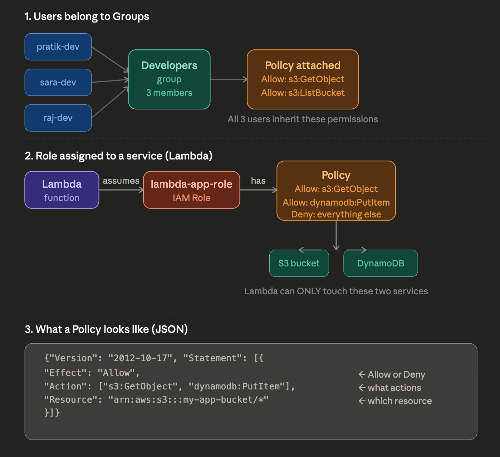

## IAM — Identity and Access Management

IAM is how AWS controls **who can do what** on your account. Think of it as the security guard + keycard system for all your AWS resources.

---

### The 4 core pieces

**Users** — a real human (you, a teammate). Has a username + password or access keys. Example: `pratik-dev` is a user who logs into the AWS console.

**Groups** — a collection of users. Instead of giving permissions to each person one by one, you put them in a group. Example: a `Developers` group gets read access to S3; everyone in that group inherits it automatically.

**Roles** — like a temporary badge for a *service* (not a human). EC2, Lambda, etc. assume a role to get permissions. Example: your Lambda function assumes a role that lets it write to DynamoDB — no hardcoded passwords needed.

**Policies** — the actual permission rules, written in JSON. They say: *allow/deny this action on this resource*. Example: a policy that says `Allow: s3:GetObject on bucket/my-app-*`.

---

### Real example flow

> You deploy a Lambda function that needs to read from S3 and write to DynamoDB.

1. Create a **Policy** — allow `s3:GetObject` and `dynamodb:PutItem`
2. Attach that Policy to a **Role** called `lambda-app-role`
3. Assign that Role to your Lambda function
4. Lambda now has *only* those two permissions — nothing else

This is **least privilege** — give only what's needed, nothing more.

---

Now here's the visual:

The diagram has 3 sections:

**Section 1** — Users (`pratik-dev`, `sara-dev`, `raj-dev`) are added to a `Developers` group. The group has one policy attached — all 3 users automatically inherit those S3 permissions. No need to set permissions per person.

**Section 2** — A Lambda function *assumes* a Role (`lambda-app-role`). That role has a policy allowing only S3 and DynamoDB access. Lambda literally cannot touch anything else — this is least privilege in action.

**Section 3** — The raw JSON of a policy. Three fields always present: `Effect` (allow/deny), `Action` (what can be done), `Resource` (what it applies to).