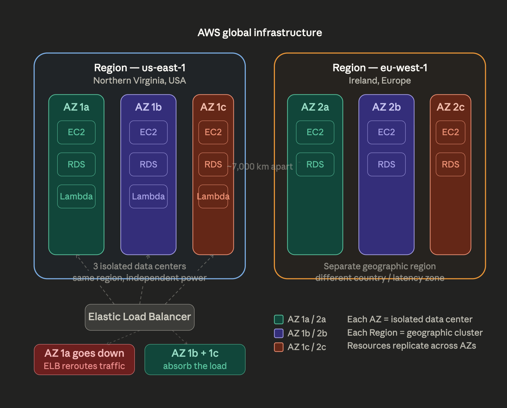

## AWS Regions & Availability Zones

### The Big Picture

AWS has physical data centers spread across the world. To organize them, they use two levels: **Regions** and **Availability Zones**.

---

### Region

A **Region** is a large geographic area — like a country or part of a continent. For example:

- `us-east-1` = Northern Virginia, USA
- `ap-south-1` = Mumbai, India
- `eu-west-1` = Ireland

When you create an AWS resource (like a server or database), you pick *which Region* it lives in. You choose based on:

- **Latency** — pick a Region close to your users
- **Compliance** — some countries require data to stay within their borders
- **Cost** — pricing varies slightly between Regions

---

### Availability Zone (AZ)

Inside each Region, there are multiple **Availability Zones** — typically 3 to 6. Each AZ is one or more separate physical data centers with its own power, cooling, and networking.

The key point: **AZs within a Region are isolated from each other**, so if one goes down (fire, flood, power outage), the others keep running. But they're still close enough to communicate with very low latency.

---

### Why it Matters

If you run everything in a single AZ and it fails, your app goes down. By spreading across **2 or 3 AZs**, you get **high availability** — your app survives a data center failure.

**Example:** You deploy two EC2 servers — one in `us-east-1a` and one in `us-east-1b` — behind a Load Balancer. If `1a` goes down, traffic automatically shifts to `1b`. Users notice nothing.

---

### The Metaphor

> A **Region** = a city. An **AZ** = a neighborhood with its own power grid.

If one neighborhood loses power, the rest of the city is completely unaffected. That's exactly how AZ isolation works.

---
#### Visuals

---
Two Regions side by side — us-east-1 (Virginia) and eu-west-1 (Ireland) — separated by roughly 7,000 km. Each is completely independent: different country, different latency, different compliance zone.
Inside each Region, 3 AZs — each is its own isolated data center with independent power and networking. Notice how the same services (EC2, RDS, Lambda) are replicated across AZs — this is the key to high availability.
The ELB scenario at the bottom shows the practical benefit: the Elastic Load Balancer distributes traffic across all 3 AZs in us-east-1. If AZ 1a fails, the ELB automatically reroutes to AZ 1b and 1c — users experience zero downtime.\
The core takeaway: Regions protect against geographic disasters, AZs protect against data center failures.